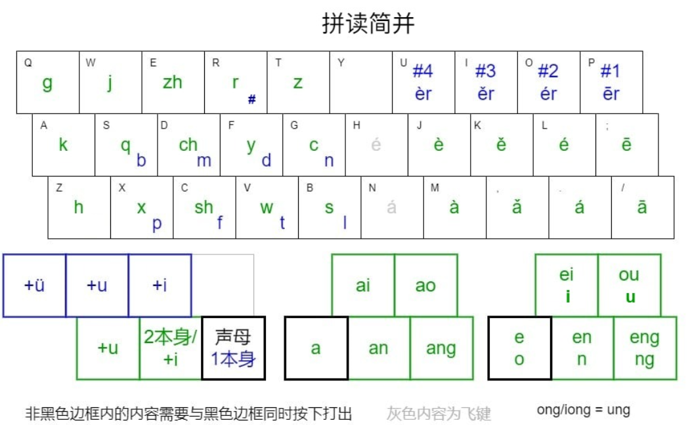

# 拼读简并 —— 入门指南

拼读并击的简单版、有序版，简称拼读简并，是 zhz 拼读并击的修改版本，追求最低的并击入门成本。

**核心理念**：双手并击，一击对应一个音，实现高速盲打。水文理论码长约为 0.8。

本方案极大降低了传统并击的记忆负担，记忆量低于大多数串击，是目前最易学的并击输入法。

## 各种方案性能比较

|                   | 小鹤双拼 | 拼读简并              | 拼读并击 | 五笔86 | 虎码 | 蓝宝石新 |
| ----------------- | -------- | --------------------- | -------- | ------ | ---- | -------- |
| 无序元素量        | 29       | /  | 95       | 200    | 241  | >400     |
| 2码/1击信息量[2]  | 410      | 1280                  | 1280     | 625    | 676  | 625      |
| 6万词语动态选重率 | 11.06% | 2.17%             | 2.17%    | 7.31%  | 2.78% | 2.00%   |

## 一、先建立一个心智模型

记住三句话，后面的规则就都能自己推出来：

1. **左手声介，右手韵调**：每个汉字的读音拆成两半，左手打"声介"，右手打"韵调"，双手同时按下（并击），一击就是一个音节。
2. **每个键位住两个声母**：左手区的键大多一蓝一绿两个声母共处一键（见键位图）。蓝的直按即得，绿的要带上它左边的键。
3. **组合键全看方位，不靠死记**：所有组合按键都是在基准键的固定方位上取键。全文只用这一套方位词：

| 方位词 | 含义 |
| ------ | ---- |
| 左1、左2 | 同一排向左数第 1、2 个键 |
| 上左1、上左2、上左3 | 上一排中，从"正上方"的左边开始数第 1、2、3 个键（正上方本身不算） |
| 右1、右2 | 同一排向右数第 1、2 个键 |
| 上右1、上右2 | 上一排中，从"正上方"的右边开始数第 1、2 个键（正上方本身不算） |

"正上方"按标准指法的列确定，例如 G 的正上方是 T，M 的正上方是 J。

**越界环绕**：向左数超出键盘左缘，绕到该排最右继续数；向右数超出右缘，绕到该排最左。例如：G 的上左 1/2/3 依次是 R、E、W；X 的左1 是 Z，左2 越界环绕到同行最右的 B。

注意：本方案中的"组合按键"全部是**同时按下**，不是先后按。

## 二、基本拆分规则

每个汉字的拼音被拆分为两个部分：

- **声介**：声母 + 介音（i、u、ü）
- **韵调**：剩下的部分——带声调的韵腹 + 韵尾（n、ng）

两半都可以为空，空的记作 `#`，`#` 后面的数字表示声调（`#3` = 无韵调、第三声）。为什么要占位？因为并击要求每一击都是"声介 + 韵调"的固定两拍，缺的一半用 # 填上，格式就永远统一。

示例：

|  读音  | 声介 | 韵调 |
| :----: | :--: | :--: |
|   bǎ   |  b   |  ǎ   |
|  zài   |  z   |  ài  |
|  bié   |  bi  |  é   |
|  jiā   |  ji  |  ā   |
|  yuān  |  yu  |  ān  |
| zhuāng | zhu  | āng  |
|  lüè   |  lü  |  è   |
|  gāo   |  g   |  āo  |
|   bǐ   |  bi  |  #3  |
|   dú   |  du  |  #2  |
|   lǜ   |  lü  |  #4  |
|   yú   |  yu  |  #2  |
|   ào   |  #   |  ào  |
|   éi   |  #   |  éi  |

**特殊情况**：`ong` / `iong` 改按 `ung` 拆分，例如 `xiōng` 拆为 `xu` + `ōng`，打的时候 ōng 用 ēng 的键位。这样 ong 不必单独占键——`tu + eng键 = tōng`，`t + eng键 = tēng`，声介不同，自动区分。

## 三、键位设计

### 声介（左手）

左手区每个键位住两个声母，一蓝一绿。两组声母都按拼音顺序、从 Q/S 列向 B 列纵向排列：

**蓝组**（b p m f / d t n l，还有零声母 #）：

| 声母 | b、p | m、f | d、t | n、l |
| ---- | ---- | ---- | ---- | ---- |
| 键位（中排/下排） | S、X | D、C | F、V | G、B |

**绿组**（g k h / j q x / zh ch sh / r y w / z c s）：

| 声母 | g、k、h | j、q、x | zh、ch、sh | r、y、w | z、c、s |
| ---- | ------- | ------- | ---------- | ------- | ------- |
| 键位（上/中/下排） | Q、A、Z | W、S、X | E、D、C | R、F、V | T、G、B |

注意 S D F G X C V B 这些键上蓝绿共处（如 S 上有 q 和 b），靠下面的规则区分：

- **蓝组**：
  - 直按 = 声母本身（如 S = b、X = p）。
  - 声母键 + 上左1 / 上左2 / 上左3 = 加介音 i / u / ü（如 bi、bu、nü）。
- **绿组**：
  - 声母键 + 左1 = 声母本身。对 j、q、x、y 得到的是 ji、qi、xi、yi 的音，对 z、c、s、zh、ch、sh、r 得到的是 zi、ci、si、zhi……的音——你不用区分"声母"和"声母+i"，输入法会根据后面的韵调自动判断。
  - 声母键 + 左2 = 加介音 u（如 xu）。对 j、q、x、y，这个 u 读作 ü（如 ju、qu、yu）。
- **零声母 #**：R 键直按（它的绿伙伴 r = R+左1）。啊、哦、儿等没有声母的音节用它开头。

以 G 键为例，G 上住着 n（蓝）和 c（绿）：

| 按键 | 声介 |
| ---- | ---- |
| G    | n    |
| GR   | ni   |
| GE   | nu   |
| GW   | nü   |
| GF   | c    |
| GD   | cu   |

越界环绕的例子（向左越界，绕到该排最右）：

| 按键 | 声介 |
| ---- | ---- |
| WT   | ju   |
| SG   | qu   |

### 韵调（右手）

**无韵腹（#）和 er**：用 U、I、O、P 四键，从左到右依次是 #4、#3、#2、#1（ér = R + O）。去声最高频，所以放在最有力的食指上——下面韵腹键的声调排序也是同一个道理。

**有韵腹**：韵腹占右手两排键，a 在下排，e 在中排，每排从食指到小指都是 4→3→2→1 声：

| 声调 | 去（4） | 上（3） | 阳平（2） | 阴平（1） |
| ---- | ------- | ------- | --------- | --------- |
| a 排 | M = à   | , = ǎ   | . = á     | / = ā     |
| e 排 | J = è   | K = ě   | L = é     | ; = ē     |

i、o、u 作韵腹时，以及有韵尾无韵腹时（in、ing、un 等），都用 e 排键位——介音在声介那半边已经交代了，输入法自动区分（如 J 既是 è 也是 ò）。

韵尾和复合韵腹用方位扩展，全部规律就是一张 2×2 的表：

|                | 近（右1 / 上右1） | 远（右2 / 上右2） |
| -------------- | ----------------- | ----------------- |
| **同排向右**   | +n（an、en）      | +ng（ang、eng）   |
| **上排向右**   | +i 尾（ai、ei）   | +u 尾（ao、ou）   |

一句话：**同排往右加鼻音，上排往右加元音尾；近的轻（n、i），远的重（ng、u）**。

以 J 键（è）为例：

| 按键 | 韵调   |
| ---- | ------ |
| J    | è、ò  |
| JK   | èn（右1 = n） |
| JL   | èng（右2 = ng） |
| JI   | èi（上右1 = i 尾） |
| JO   | òu（上右2 = u 尾） |

向右越界时绕到该排最左，以 ; 键（ē）为例：

| 按键 | 韵调   |
| ---- | ------ |
| ;    | ē      |
| ;H   | ēn（右1 越界 → H） |
| ;J   | ēng（右2 越界 → J） |
| ;Y   | ēi（上右1 越界 → Y） |
| ;U   | ōu（上右2 越界 → U） |

## 四、输入方式

### 1. 单字输入

- **一击字**：只打声介即可上屏。每个声介键位对应一个最高频字，共 51 个，如：的、了、在、是、和、一、这、他、我、等。
- **其余字**：打出声介 + 韵调，再进行选重；与空格同时按下可以一击直接上屏首选。

### 2. 词输入

- **二字词**：第一击（字1 声介+韵调）+ 第二击（字2 声介+韵调）
- **多字词**：第一击 + 第二击（带空格）+ 第三击（末字 声介+韵调）

### 3. 标点输入

| 按键    | 首选 | 次选（按键+空格） |
| ------- | ---- | ---------------- |
| J       | ，   | ～               |
| K       | 。   | .                |
| L       | ？   | ！               |
| ;       | ：   | ；               |
| H       | 、   | ·                |
| O       | “    | ‘                |
| P       | ”    | ’                |
| U       | 「   | 『               |
| I       | 」   | 』               |
| M       | ……   |                  |
| N       | ——   | —                |
| Y       | ¥    | $（€、£ 在同键候选中） |
| ,       | 《   | 〈               |
| .       | 》   | 〉               |
| /       | /    |                  |
| UI 或 UO | （   | 【               |
| OP 或 IP | ）   | 】               |
| JO      | ：“  | :「              |
| JP      | 。”  | 。」             |

## 五、选重与翻页

- 空格：首选
- J K：次选
- J L：三选
- J ;：四选
- K L：五选
- { }：翻页

## 六、进阶功能（选学）

### 辅助码

与拼读并击一样，打出读音后，可加打部首的声介进行筛选。以下是部首的读音参考。

| **声介** | **部首**           | **声介** | **部首**                   |
| -------- | ------------------ | -------- | -------------------------- |
| **#**    | 儿而耳二           | **gu**   | 弓工骨谷瓜广鬼             |
| **i**    | 牙言羊业衣音九酉又 | **k**    | 口                         |
| **u**    | 瓦王韦文           | **ku**   | 口匚冂凵                   |
| **v**    | 用羽雨聿月         | **h**    | 禾黑一                     |
| **b**    | 丷八白勺贝卜不     | **hu**   | 虎户火灬                   |
| **bi**   | 鼻匕𩰪疒           | **ji**   | 几己见角卩巾金斤臼         |
| **p**    | 父爻               | **qi**   | 气欠                       |
| **pi**   | 皮片丿             | **qv**   | 犭犬                       |
| **m**    | 马毛矛门母目       | **xi**   | 夕酉香小⺌心辛行           |
| **mi**   | 米宀皿             | **xv**   | 穴彐血                     |
| **f**    | 方非风缶阜父       | **zh**   | 乛支止豕舟                 |
| **d**    | 大歹刂宀刀斗豆     | **zhu**  | 竹爪隹                     |
| **di**   | 丶                 | **ch**   | 厂车齿彳赤                 |
| **t**    | 亠                 | **chu**  | 虫巛                       |
| **ti**   | 田                 | **sh**   | 彡舌身尸十食矢豕礻士示手首 |
| **tu**   | 土                 | **shu**  | 殳鼠丨水                   |
| **ni**   | 鸟牛               | **r**    | 人日肉                     |
| **nv**   | 女                 | **z**    | 子辶走廴                   |
| **l**    | 老耒               | **zu**   | 足                         |
| **li**   | 力立               | **c**    | 艹升                       |
| **lu**   | 龙鹿               | **cu**   | 寸                         |
| **g**    | 宀戈革鬲艮         | **s**    | 三糸幺皿                   |

同时设置了一些无理部首，分布在右半键盘上，增强离散。

| **6**         | **7**          | **8**          | **9**         | **0**          |
| ------------- | -------------- | -------------- | ------------- | -------------- |
| **页** (ye4)  | **扌** (shou3) | **亻** (ren2)  | **讠** (yan2) | **忄** (xin1)  |
| **钅** (jin1) | **木** (mu4)   | **氵** (shui3) | **石** (shi2) | **山** (shan1) |
| **邑** (yi4)  | **纟** (si1)   | **礻** (shi4)  | **鱼** (yu2)  | **饣** (shi2)  |

### 声介合并

b、p、m、f 与 bu、pu、mu、fu 共用键位，不用区分：后面跟了韵调时读 b、p、m、f（如 bā、bō、bān），没有韵调时自动补 u（如 bù、pū、mù、fù）。y、w 同理：无韵调时自动是 yi、wu。

### 飞键优化

部分组合不太好按，为此设置了额外的替代按法，称为飞键。飞键与原键并存，用哪个都可以。

#### 声介飞键

组一（建议使用）

| 声介 | 飞键 | 原键 |
| ---- | ---- | ---- |
| bi   | QF   | QS   |
| pi   | AV   | AX   |

组二（建议使用）：绿组声母可以直按，不必带左1。

| 声介   | 飞键 | 原键 |
| ------ | ---- | ---- |
| g      | Q    | QT   |
| j ji   | W    | WQ   |
| zh zhi | E    | EW   |
| h      | Z    | ZB   |
| sh shi | A    | CX   |
| x xi   | T    | ZX   |

组三（按需使用）：B、G、T 三键并击时食指要横向大跳，这组飞键把任务交给其他手指。

| 声介 | 飞键 | 原按键 |
| ---- | ---- | ------ |
| l    | AR   | B      |
| li   | AE   | BF     |
| lu   | AW   | BD     |
| z zi | ZF   | TR     |
| zu   | ZD   | TE     |
| c ci | CD   | GF     |
| cu   | CS   | GD     |
| xu   | XF   | BX     |
| s si | SR   | VB     |
| su   | SE   | CB     |

#### 韵调飞键

组一（建议使用）：越界环绕时上下排互换，改善小拇指指法。

| 韵调 | 飞键 | 原键 |
| ---- | ---- | ---- |
| ei1  | PH   | ;Y   |
| ou1  | PJ   | ;U   |
| ai1  | ;N   | /H   |
| ao1  | ;M   | /J   |

组二（建议使用）：阳平（第二声）与韵尾相拼时，H 可作 é 键、N 可作 á 键，方位规则不变。

| 韵调 | 飞键 | 原键 |
| ---- | ---- | ---- |
| én   | HJ   | L;   |
| éng  | HK   | LH   |
| éi   | HU   | LP   |
| óu   | HI   | LY   |
| án   | NM   | ./   |
| áng  | N,   | .N   |
| ái   | NJ   | .;   |
| áo   | NK   | .H   |

组三（按需使用）：H 键直按表示 ǒu，N 键直按表示 ǎo。

| 韵调 | 飞键 | 原键 |
| ---- | ---- | ---- |
| ǒu   | H    | KP   |
| ǎo   | N    | ,;   |

### 612 一击词

左手打第一字的声介，右手同时打末字的首笔，一键打出常用词，共 612 个。末字若含 人、口、日，则优先用部首键代替首笔键。

上屏后可以直接输入下文，自动上屏。空格同时按下则上屏次选。

右手笔画键如下：

| 笔     | 按键 |
| ------ | ---- |
| 撇㇒   | UI   |
| 竖㇑   | IO   |
| 点㇔   | OP   |
| 人日口 | UO   |
| 折㇄   | IP   |
| 横㇐   | UP   |

例如：

| 词   | 按键   |
| ---- | ------ |
| 不过 | S + UP |
| 不是 | S + UO |
| 并且 | QF + IO |

## 七、安装说明

1. 安装【小狼毫（RIME）输入法引擎】
2. 右键右下角「中」图标将配置文件复制到用户文件夹
3. 重新部署即可使用

如有疑问，可加交流群：374971723

